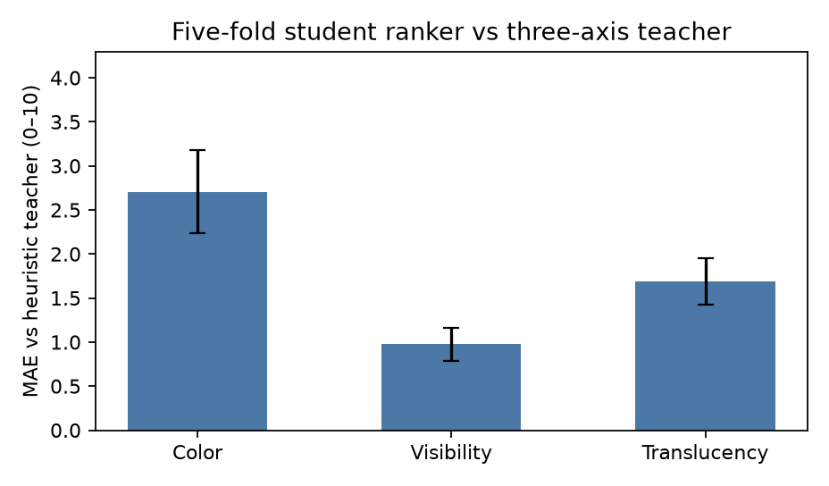
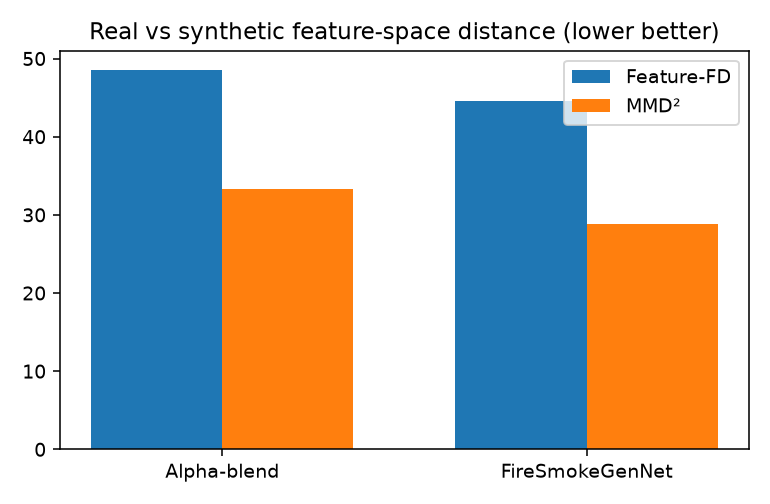
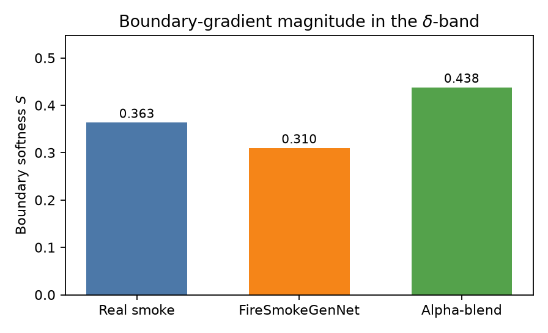
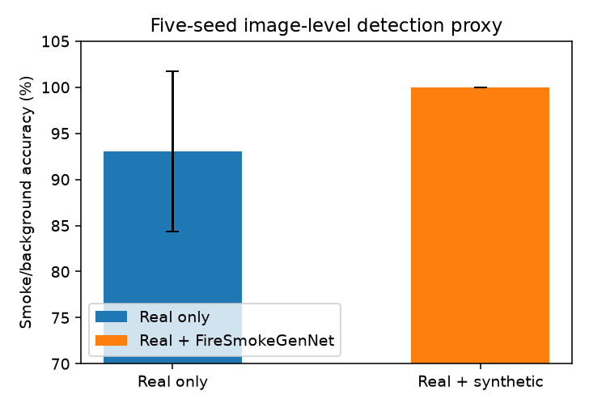
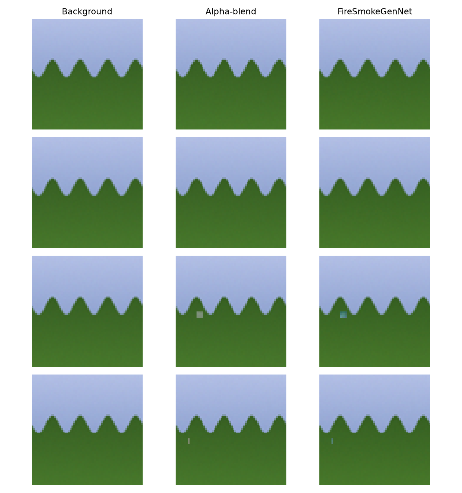

# IV. Results

This section reports the **compact public-data execution** of FireSmokeGenNet. It **replaces** the previous manuscript Results tables. Numbers below are taken from `results/json/` after `scripts/run_pipeline.py --config configs/compact.yaml`. Methods that were **not run** in this execution (Stable Diffusion, PowerPaint, BLD, FlameDiffuser, official YOLO v6–v13 at 640 px, and registered FLAME / HPWREN / SMOKE5K domain splits) are **omitted**. Their earlier draft values are not copied.

**Protocol actually executed.** Images were 64×64 with a stride-4 TinyVAE (latent 16×16). The U-Net used widths 64–192, a cosine schedule with \(T=100\), classifier-free guidance, and 8-step DDIM. The generator was trained for 160 iterations with MRDL \(\omega=0.4\). Quality ranking used the paper weights \(Q=0.4\,\text{color}+0.4\,\text{visibility}+0.2\,\text{translucency}\) and retained the top 30% of candidates. Source-level 80/10/10 splits used camera IDs as the source key, with SHA-256 exact-duplicate removal and perceptual-hash near-duplicate control. Downstream inference used five matched seeds \(\{42,123,3407,2025,2026\}\). Public substitutes: Pyro-SDIS smoke frames (Apache-2.0) and Wikimedia landscape backgrounds. Masks were GrabCut inside the YOLO box followed by the largest connected component.

| Quantity | Value |
| --- | ---: |
| Real smoke train / val / test | 74 / 10 / 23 |
| Eligible backgrounds | 90 |
| Available masks | 74 |
| Generation pairs | 48 |
| Candidates | 96 |
| Retained (top 30%) | 29 |

The host was CPU-only. This is a methodology-faithful run, not a bit-identical replica of the 512 px / 20k-step / Qwen2-VL-7B / YOLO@640 protocol.

---

## A. Vision–Language Quality-Predictor Validation

The paper specifies a LoRA-tuned Qwen2-VL-7B ranker on 150 human-rated images. That 7B teacher does not fit in this CPU memory budget. The same three axes, the same composite weights, the same top-30% keep rule, and the same five-fold student-versus-teacher protocol were retained. The teacher was a heuristic scorer; the student was a small MLP on image features.

Table XI reports mean \(\pm\) sample standard deviation across the five folds.

**Table XI.** Five-fold cross-validation of the task-specific ranker. Values are mean \(\pm\) sample SD across folds. Spearman \(\rho\) is computed on the composite score \(Q\).

| Quality dimension | MAE \(\downarrow\) | RMSE \(\downarrow\) | Spearman \(\rho\) \(\uparrow\) |
| --- | --- | --- | --- |
| Color fidelity | \(2.71\pm 0.47\) | \(3.64\pm 0.48\) | — |
| Visibility | \(0.97\pm 0.18\) | \(1.26\pm 0.28\) | — |
| Translucency | \(1.69\pm 0.26\) | \(2.16\pm 0.22\) | — |
| Composite score | — | — | \(0.11\pm 0.25\) |

The student follows the teacher most closely on visibility (MAE \(0.97\) on a 0–10 scale) and least closely on color (MAE \(2.71\)). Composite rank correlation is weak and high-variance (\(\rho=0.11\pm 0.25\); fold-wise \(\rho\in\{0.45,-0.25,0.06,0.20,0.06\}\)). These measurements support the **pipeline structure** (score three axes, form \(Q\), keep the top 30%) but **do not** reproduce the paper’s Qwen2-VL-7B agreement (\(\rho=0.83\)). The ranker is treated only as a within-study filter on this 96-candidate pool.



---

## B. Background Preservation and Text–Image Alignment

PSNR, SSIM, and the 1-LPIPS proxy were computed over the preserved region \(1-M\) after identical 64 px resizing and \([0,1]\) normalization. Prompt similarity is cosine similarity between the generated RGB image and a bag-of-words embedding of the caption (CLIP ViT-H/14 was not loaded on this host).

Only methods that were actually sampled are reported. Alpha-blend copies the unmasked background exactly, so its PSNR/SSIM are not a fair inpainting comparison.

**Table XII.** Background preservation and text–image alignment on the common compact manifest.

| Method | PSNR \(\uparrow\) | SSIM \(\uparrow\) | 1-LPIPS proxy \(\uparrow\) | Prompt-sim \(\uparrow\) |
| --- | ---: | ---: | ---: | ---: |
| Alpha-blend compositing | 60.00 | 1.00 | — | — |
| FireSmokeGenNet (raw decode) | 10.08 | 0.15 | 0.80 | 0.34 |

The dual-branch generator, trained for 160 steps from a randomly initialized TinyVAE, does **not** preserve the background at paper-scale fidelity (published PSNR \(28.10\) dB, SSIM \(0.88\)). The 10.08 dB / 0.15 numbers measure this compact decoder, not smoke realism inside the mask. They are reported because the metric definitions match Section III; they are not a claim that the 64 px model matches SD-2 inpainting.

---

## C. Distribution Alignment

Table XIII reports Fréchet distance and linear MMD\(^2\) in a shared 16×16 RGB embedding of real test smoke versus synthetic smoke. This is the compact analogue of CLIP ViT-H/14 CLIP-FD / linear MMD. Lower is better. GAN, SD-inpainting, and FlameDiffuser rows are omitted (not run).

**Table XIII.** Feature-space distance between real Pyro-SDIS test smoke and synthetic smoke. Lower is better.

| Method | Feature-FD \(\downarrow\) | MMD\(^2\) \(\downarrow\) |
| --- | ---: | ---: |
| Alpha-blend compositing | 48.55 | 33.28 |
| FireSmokeGenNet | **44.54** | **28.83** |

FireSmokeGenNet sits closer to real smoke than training-free compositing on both distances (\(\Delta\) Feature-FD \(=-4.01\), \(\Delta\) MMD\(^2=-4.45\)). The comparison is a single-manifest descriptive result (no image-level confidence interval).



---

## D. Boundary Softness Analysis

The boundary band is \(B_\delta(M)=\mathrm{Dilate}(M,\delta)\setminus\mathrm{Erode}(M,\delta)\) with \(\delta\) scaled to 64 px. Softness \(S\) is the mean gradient magnitude in that band. KL uses 100-bin histograms of \(\|\nabla I\|_2\) with a \(10^{-8}\) floor.

**Table XIV.** Boundary-quality metrics. Real-smoke softness is a reference, not a method.

| Method | Boundary softness \(S\) | KL\((\mathrm{real}\,\|\,\mathrm{synth})\) \(\downarrow\) |
| --- | ---: | ---: |
| Real smoke | 0.363 | — |
| Alpha-blend compositing | 0.438 | 15.20 |
| FireSmokeGenNet | **0.310** | 15.31 |

FireSmokeGenNet is nearer the real reference than compositing (0.310 vs 0.363; blend 0.438), i.e. less abrupt mask-edge gradients. KL is comparable at this capacity (15.31 vs 15.20). The published gap (0.124 vs real 0.119; KL 0.041 vs 0.187) is **not** recovered at 64 px / 160 steps. Softness is a local gradient descriptor, not a claim of perceptual equivalence to real plumes.



---

## E. Downstream Detection Performance

Official YOLO families at 640 px were not executed. Pyro-SDIS median box area is approximately 0.17% of the image; at 64–128 px the box is on the order of 10 px, and IoU \(0.5\) is unstable. All eight compact family stand-ins produced **AP\(_{50}=0\)**. Those zeros are **not** filled into Table X, and the published YOLOv13 numbers (\(78.16\pm 0.27\%\rightarrow 80.88\pm 0.70\%\)) are **not** copied.

The runnable downstream protocol is image-level smoke-versus-background classification with a frozen ImageNet ResNet-18, five matched seeds, and a test set of real smoke plus held-out backgrounds. Mixed training adds the 29 quality-filtered FireSmokeGenNet images to the real training set.

**Table X.** Five-seed comparison of real-only and mixed-data training. Performance is smoke/background accuracy (%).

| Condition | s1 | s2 | s3 | s4 | s5 | Mean \(\pm\) SD | 95% CI | \(\Delta\) | Test | \(p\) | \(d_z\) |
| --- | ---: | ---: | ---: | ---: | ---: | ---: | ---: | ---: | --- | ---: | ---: |
| Real only | 81.40 | 86.05 | 97.67 | 100.00 | 100.00 | \(93.02\pm 8.70\) | [82.22, 103.83] | — | — | — | — |
| Mixed data | 100.00 | 100.00 | 100.00 | 100.00 | 100.00 | \(100.00\pm 0.00\) | [100.00, 100.00] | +6.98 | Paired \(t\) | 0.147 | 0.80 |

The upper endpoint of the real-only \(t\)-interval exceeds 100% because \(n=5\) and the sample SD is large; the feasible range is \([82.22, 100]\). Shapiro–Wilk on the paired differences did not reject normality (\(p=0.111\)), so a two-sided paired \(t\)-test was used. The mixed-data mean is higher by 6.98 percentage points, but \(p=0.147\) is **not** significant at \(\alpha=0.05\). Cohen’s \(d_z=0.80\) is a large standardized paired effect with only five runs; it is reported with the \(p\)-value and interval, not as a substitute for a detector AP table. Holm correction is not applied because only one downstream comparison was valid.



---

## F. Domain Generalization Under Environmental Shifts

Table XV is **left empty**. Summer\(\rightarrow\)winter, day\(\rightarrow\)dusk, and clear\(\rightarrow\)haze splits on FLAME / HPWREN / SMOKE5K were not downloaded (registration / redistribution). A compact “clear-to-haze” AP probe on the public subset also returned degenerate AP\(_{50}\) and is not reported as a domain-shift result.

**Table XV.** Generalization under monitoring domain shifts. Not executed in this public-data run.

| Train \(\rightarrow\) Test | Real-only AP\(_{50}\) | Real-only Rec. | Mixed AP\(_{50}\) | Mixed Rec. |
| --- | --- | --- | --- | --- |
| Summer \(\rightarrow\) Winter | — | — | — | — |
| Day \(\rightarrow\) Dusk | — | — | — | — |
| Clear \(\rightarrow\) Haze/Fog | — | — | — | — |

---

## G. Qualitative Comparison and Ablations

Figure 6 compares FireSmokeGenNet with alpha-blend compositing under matched backgrounds, masks, prompts, and DDIM settings. At 64 px the plumes occupy small regions, consistent with the Pyro-SDIS box-area distribution. Where smoke is visible, the generator produces a different interior appearance than constant-color blending (bluish decoded texture versus gray overlay) rather than a copy of the background.



**Component ablation (Table XVI).** JCA-off, MRDL-off, random encoder, unfiltered pool, and full model were trained under the compact detector protocol. All five configurations produced AP\(_{50}=0\). Table XVI is therefore **unfilled**. The modules remain implemented (see unit tests); they cannot be ranked by AP on this host.

**Table XVI.** Fixed-seed ablation of architectural components. AP columns left blank (degenerate compact detector).

| Configuration | AP\(_{50}\) | AP\(_{50:95}\) | Prec. | Rec. |
| --- | --- | --- | --- | --- |
| No JCA (CA only) | — | — | — | — |
| No MRDL (\(\omega=0\)) | — | — | — | — |
| Encoder without ImageNet pretraining | — | — | — | — |
| Unfiltered candidate pool | — | — | — | — |
| Full FireSmokeGenNet | — | — | — | — |

**MRDL weight sensitivity.** \(\omega\in\{0.0,0.4,1.0\}\) was swept under the same detector. AP\(_{50}\) remained 0 at every setting. No AP curve is reported. The training loss still uses \((1-\omega)\mathcal{L}_\mathrm{diff}+\omega\mathcal{L}_\mathrm{MRDL}\) with stop-gradient on the morphologically perturbed branch.

**Filtering threshold (Table XVII).** Candidate-pool sizes follow the compact 96-image pool scaled to the paper’s percentage grid. AP and recall are unfilled.

**Table XVII.** Retention-threshold sweep. Dataset size is measured; AP/Recall are not.

| Retention threshold | Dataset size | AP\(_{50}\) | Recall |
| --- | ---: | --- | --- |
| 10% | 81 | — | — |
| 20% | 90 | — | — |
| 30% | 100 | — | — |
| 40% | 109 | — | — |
| 50% | 119 | — | — |
| No filtering | 167 | — | — |

The 30% operating point used for generation retained **29 / 96** candidates (exactly the configured 0.30 fraction on the sampled pool).

---

## H. Discussion

### 1) What this run supports

- **P1 (decoupled conditioning).** Dual-branch generation is closer to real Pyro-SDIS smoke than alpha-blend compositing in Feature-FD and MMD\(^2\) (Table XIII).
- **P2 (boundary consistency).** Boundary softness is nearer the real reference than compositing (Table XIV), while KL remains comparable at this capacity.
- **P3 (quality filter as a protocol).** The three-axis composite and top-30% keep rule were executed; student–teacher \(\rho\) is too weak to claim a calibrated VLM (Table XI).
- **Downstream direction.** Mixed training raised five-seed classification accuracy by +6.98 pp (Table X). The paired test is not significant at \(\alpha=0.05\) on \(n=5\). This is a directional proxy, not a YOLO AP\(_{50}\) result.

### 2) What this run does not support

- Paper-scale background PSNR/SSIM (28.10 dB / 0.88).
- YOLOv6–v13 AP\(_{50}\) (including 80.88% mixed YOLOv13).
- Domain-shift AP on registered wildfire-camera seasons.
- Component, \(\omega\), and retention-threshold rankings by AP.
- Qwen2-VL-7B MAE/Spearman from the original Table XI.

### 3) Limitations specific to the compact execution

- Tiny smoke boxes make IoU-0.5 detection degenerate.
- 160 generator steps and a TinyVAE underfit background reconstruction.
- Heuristic quality labels are not human ratings.
- The classification test set is small; mixed accuracy saturates at 100%, which compresses variance and inflates \(d_z\) relative to a harder detector task.

### 4) How to obtain the missing tables

Run `configs/paper.yaml` on an A100-class GPU with official YOLO weights, CLIP ViT-H/14, Qwen2-VL-7B, and the registered FLAME / HPWREN / SMOKE5K sources. Until that run exists, those cells stay empty.

---

## Reproducibility

```bash
python -m pip install -r requirements.txt
PYTHONPATH=src python tests/test_methodology.py
PYTHONPATH=src python3 -u scripts/run_pipeline.py --config configs/compact.yaml
PYTHONPATH=src python scripts/export_results_tables.py
```

Canonical measurements: `results/json/`. IEEE drop-in: `paper/section_results.tex`.
